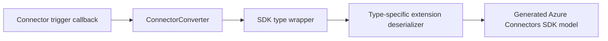

# SDK-Type Bindings for Azure Functions

SDK-type bindings let Azure Functions expose connector trigger payloads as
strongly typed Azure Connectors SDK models instead of raw JSON dictionaries.

## Ownership Model

SDK-type deserialization belongs to the
[`azurefunctions-extensions-connectors`](https://github.com/Azure/azure-functions-python-extensions)
package, not to generated connector modules in this SDK.

The responsibilities are intentionally separated:

| Component | Responsibility |
|-----------|----------------|
| Azure Connectors SDK | Generated dataclasses and connector clients that represent the managed connector contract |
| Azure Functions connector extension | Trigger payload normalization, type-specific field conversion, and nested-model deserialization |
| Azure Functions worker | Binding discovery and converter invocation |

Generated connector files are replaced whenever a connector is regenerated.
Do not add `from_json()` methods or other hand-authored binding logic to those
files, and do not add connector-specific binding templates to the SDK generator.

## Why Deserialization Is Extension-Owned

Trigger payloads are runtime binding contracts and can differ from the managed
connector Swagger contract:

- A trigger can deliver either a batch or a single item depending on `splitOn`.
- Callback field names can differ from generated response-model wire names.
- Individual bindings can require conversions, such as mapping Office 365
  importance strings to integer SDK values.
- Nested objects such as attachments and sensitivity labels need typed parsing.
- Some bindings return a list, while others return a generated wrapper object.

These behaviors are specific to each Azure Functions SDK type. Keeping them in
the extension allows each type to provide its own deserializer without coupling
the generic Swagger generator to runtime-specific payload shapes.

## Runtime Flow



The Office 365 implementation is under
`azurefunctions-extensions-connectors/azurefunctions/extensions/connectors/office365/`:

- The parent package's `_sdk_type.py` centralizes payload storage, error
  wrapping, and `supports_deferred_binding()` for every connector.
- The parent package's `_deserialization.py` maps generated dataclasses and
  normalizes the common connector callback envelope.
- The Office 365 `_deserialization.py` contains its aliases, conversions, and
  type-specific deserializers.
- Each public SDK type wrapper selects its deserializer with `_deserialize`.
- `connectorConverter.py` maps the function annotation to the wrapper.

## Payload Shapes

The extension normalizes both callback shapes.

### Batch

```json
{
  "body": {
    "value": [
      { "id": "item1", "subject": "First item" },
      { "id": "item2", "subject": "Second item" }
    ]
  }
}
```

### Single Item

```json
{
  "body": {
    "id": "item1",
    "subject": "Single item"
  }
}
```

## Adding a Binding Type

### 1. Keep the SDK Model Generated

Confirm that the required dataclass and its nested types exist in the generated
connector module. If the Swagger contract is wrong, fix the SDK generator and
regenerate. Do not add runtime deserialization methods to the generated model.

### 2. Add a Type-Specific Deserializer

Add a function to the connector's extension-owned deserialization module. It
must accept a `Datum` and return the exact SDK model shape expected by the
binding.

```python
def deserialize_messages(data: Datum) -> list[GeneratedMessage]:
    """Deserialize connector callback messages."""
    return [
        deserialize_model(GeneratedMessage, item)
        for item in parse_payload(data)
    ]
```

Use explicit aliases or converters when the callback contract differs from the
generated model:

```python
def deserialize_legacy_messages(data: Datum) -> list[LegacyMessage]:
    """Deserialize legacy messages with binding-specific conversions."""
    return [
        deserialize_model(
            LegacyMessage,
            item,
            aliases={"to": "toRecipients"},
            converters={"importance": _deserialize_importance},
        )
        for item in parse_payload(data)
    ]
```

### 3. Add the SDK Type Wrapper

The wrapper combines the generated model used in function annotations with the
shared extension base and selects the deserializer.

```python
class Message(
    ConnectorSdkType[list[GeneratedMessage]],
    GeneratedMessage,
):
    """Azure Functions binding for connector messages."""

    _deserialize = staticmethod(deserialize_messages)
```

### 4. Export the Wrapper

Update the extension package only:

1. Export the wrapper from the connector package.
2. Derive it from the shared `ConnectorSdkType`; the converter discovers
  supported types through this base class without a central registration list.
3. Add focused extension tests.

The Azure Connectors SDK package exports only generated model types and does not
need a binding-specific registration change.

### 5. Test Behavior

For every deserializer, cover:

- Batch and single-item callback shapes.
- JSON strings and decoded dictionaries when both can reach the converter.
- Field-name aliases between callback JSON and generated model attributes.
- Binding-specific scalar conversions.
- Nested generated models.
- Empty and malformed payload behavior.
- The exact return shape: list, single model, or generated wrapper.

Run the extension tests against the local Azure Connectors SDK source so the
test cannot accidentally use an older installed package that still has a
`from_json()` method.

## Supported Office 365 Bindings

| Extension SDK type | Deserialized SDK model | Return shape |
|--------------------|------------------------|--------------|
| `ClientReceiveMessage` | `azure.connectors.office365.ClientReceiveMessage` | List of messages |
| `GraphClientReceiveMessage` | `azure.connectors.office365.GraphClientReceiveMessage` | List of messages |
| `GraphCalendarEventClientReceive` | `azure.connectors.office365.GraphCalendarEventClientReceive` | List of events |
| `GraphCalendarEventListWithActionType` | `azure.connectors.office365.GraphCalendarEventListWithActionType` | Event-list wrapper |

## Consumer Example

```python
from typing import List

import azure.functions as func
import azurefunctions.extensions.connectors.office365 as office365

app = func.FunctionApp()


@app.connector_trigger(arg_name="messages")
def process_emails(
    messages: List[office365.ClientReceiveMessage],
) -> None:
    for message in messages:
        print(message.subject)
        print(message.from_)
        print(message.importance)
```

Application code continues to use the extension's public SDK type annotation.
The extension converter returns generated Azure Connectors SDK dataclass
instances after applying the binding-specific deserializer.
